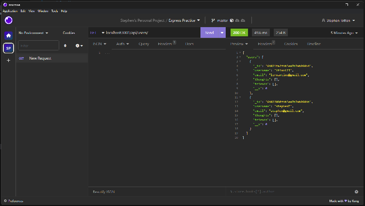

# Social Media API

## Table of Contents

* [Project Description](#description)
* [Usage](#usage)
* [Contribution](#contribution)
* [Installation](#installation)
* [Testing](#testing)
* [License](#license)

## Description
Create users, thoughts, and friend using an API and MongoDB database connection.

## Usage
Using Insomnia, test various routes via localhost to ensure proper CRUD operations.

## Installation

- [Requires npm installation.](https://docs.npmjs.com/cli/v9/commands/npm-install)

## Testing
No testing required.

## Contribution
No other contributors.

## Questions
### Send questions to this email:
[s.g.totten@gmail.com](mailto:s.g.totten@gmail.com)
### You can also contact me via Github:
[Crothos](https://github.com/crothos)

## License
This project is licensed under the MIT license.

